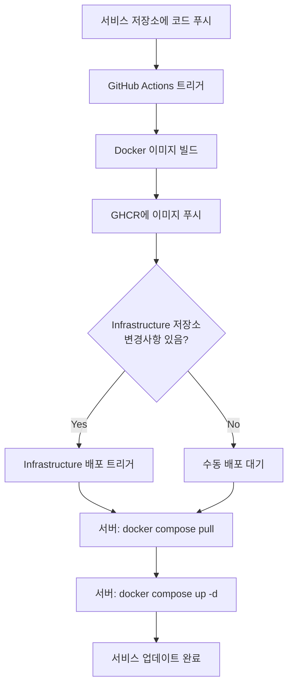

# Index Page - Microservices Infrastructure

이 저장소는 가족 서비스를 위한 마이크로서비스 인프라를 관리합니다. Nginx 리버스 프록시를 통해 여러 독립적인 서비스를 오케스트레이션하고, GitHub Container Registry (GHCR)를 활용한 자동 배포 파이프라인을 제공합니다.

## 🏗️ 마이크로서비스 아키텍처

### 아키텍처 개요

```
Internet (HTTPS)
       ↓
┌─────────────────────────────────────────┐
│  Oracle Cloud Server (hstarsp.net)      │
│  ┌───────────────────────────────────┐  │
│  │   Nginx Reverse Proxy             │  │
│  │   - SSL/TLS Termination           │  │
│  │   - Routing & Load Balancing      │  │
│  │   - Security Headers              │  │
│  └──────────┬────────────────────────┘  │
│             │                            │
│   ┌─────────┼──────────────┐            │
│   │         │              │            │
│ ┌─▼──┐  ┌──▼───┐  ┌───────▼────────┐   │
│ │Main│  │High  │  │  Real Estate   │   │
│ │Page│  │School│  │   Calculator   │   │
│ └────┘  └──────┘  │ ┌────┐  ┌────┐ │   │
│                    │ │ FE │  │ BE │ │   │
│                    │ └────┘  └────┘ │   │
│                    └────────────────┘   │
└─────────────────────────────────────────┘
```

### 서비스 구성

| 서비스 | 역할 | 이미지 소스 | URL |
|--------|------|-------------|-----|
| **Nginx Proxy** | 리버스 프록시, SSL 처리 | `nginx:alpine` | - |
| **Main Page** | 랜딩 페이지 | 로컬 빌드 | https://hstarsp.net/ |
| **Highschool Calendar** | 입시일정 선택 서비스 | GHCR | https://hstarsp.net/highschool/ |
| **Real Estate Calculator (FE)** | 부동산 계산기 프론트엔드 | GHCR | https://hstarsp.net/realestate/ |
| **Real Estate Calculator (BE)** | 부동산 계산기 백엔드 API | GHCR | https://hstarsp.net/api/realestate/ |

## 📂 저장소 구조

```
indexpage/
├── docker-compose.yml              # 서비스 오케스트레이션
├── .gitignore                      # Git 제외 파일 목록
├── README.md                       # 이 문서
├── .github/
│   └── workflows/
│       └── deploy.yml              # 자동 배포 워크플로우
├── nginx/
│   ├── nginx.conf                  # Nginx 메인 설정
│   ├── conf.d/
│   │   └── default.conf            # 라우팅 규칙 및 프록시 설정
│   └── ssl/
│       ├── fullchain.pem           # SSL 인증서 (gitignored)
│       ├── privkey.pem             # SSL 개인키 (gitignored)
│       └── README.md               # SSL 인증서 관리 가이드
├── main-page/
│   ├── Dockerfile                  # Main Page 이미지 빌드
│   ├── nginx.conf                  # Main Page용 Nginx 설정
│   └── index.html                  # 랜딩 페이지 HTML
└── docs/
    ├── GUIDE-DEPLOY-PROCESS.md     # 배포 프로세스 상세 가이드
    ├── BACKEND-SERVICE-GUIDE.md    # 백엔드 서비스 추가 가이드
    ├── HIGHSCHOOL-SETUP.md         # Highschool Calendar 설정 가이드
    └── HIGHSCHOOL-DOCKERFILE-FIX.md # Dockerfile 이슈 해결 가이드
```

## 🚀 배포 프로세스

### 자동 배포 플로우



### 배포 타입

1. **서비스 코드 업데이트**
   - 각 서비스 저장소에서 코드 수정
   - GHCR에 새 이미지 자동 푸시
   - 서버에서 수동으로 `docker compose pull` 실행

2. **인프라 설정 변경**
   - indexpage 저장소에서 설정 수정
   - GitHub Actions가 자동으로 서버 배포
   - SSL 인증서 자동 보존

자세한 배포 프로세스는 **[GUIDE-DEPLOY-PROCESS.md](GUIDE-DEPLOY-PROCESS.md)** 참조

## 🔧 주요 기능

### 1. SSL/TLS 자동 관리
- Let's Encrypt 인증서 사용
- 배포 시 인증서 자동 백업 및 복원
- HTTPS 강제 리다이렉트

### 2. 독립적인 서비스 배포
- 각 서비스는 독립적인 저장소에서 관리
- GHCR를 통한 이미지 버전 관리
- 서비스별 독립적인 배포 가능

### 3. 자동화된 CI/CD
- GitHub Actions를 통한 자동 빌드
- 이미지 자동 푸시 및 배포
- 무중단 배포 지원

## 📖 가이드 문서

### 시작하기
- **[LOCAL-DEVELOPMENT.md](LOCAL-DEVELOPMENT.md)** - 로컬 개발 환경 설정 가이드
- **[BRANCHING-STRATEGY.md](BRANCHING-STRATEGY.md)** - Git 브랜치 전략 및 워크플로우
- **[GUIDE-DEPLOY-PROCESS.md](GUIDE-DEPLOY-PROCESS.md)** - 배포 프로세스 완전 가이드
- **[.vscode/tasks.json](.vscode/tasks.json)** - VS Code 개발 태스크 (Cmd+Shift+P → "Run Task")
- **초기 설정 방법**은 아래 "초기 설정" 섹션 참조

### 서비스 관리
- **[BACKEND-SERVICE-GUIDE.md](BACKEND-SERVICE-GUIDE.md)** - 백엔드 서비스 추가 방법
- **[HIGHSCHOOL-SETUP.md](HIGHSCHOOL-SETUP.md)** - Highschool Calendar 분리 가이드
- **[nginx/ssl/README.md](nginx/ssl/README.md)** - SSL 인증서 관리

### 문제 해결
- **[HIGHSCHOOL-DOCKERFILE-FIX.md](HIGHSCHOOL-DOCKERFILE-FIX.md)** - Docker 빌드 이슈
- **"트러블슈팅" 섹션** (아래 참조)

## 🛠️ 초기 설정

### 1. GitHub 저장소 생성

```bash
# GitHub에서 'indexpage' 저장소 생성

# 로컬에서 Git 초기화
cd /Users/seonpillhwang/GitHub/homegroup/indexpage
git init
git branch -M main
git add .
git commit -m "Initial infrastructure setup"
git remote add origin https://github.com/YOUR_USERNAME/indexpage.git
git push -u origin main
```

### 2. GitHub Secrets 설정

저장소 Settings → Secrets and variables → Actions에서 추가:

- `REMOTE_HOST` - 서버 IP 또는 호스트명
- `REMOTE_USER` - SSH 사용자명 (예: ubuntu)
- `SSH_PRIVATE_KEY` - 서버 접속용 SSH 개인키

### 3. 환경변수 설정 (.env)

**로컬 개발 환경:**

```bash
# .env 파일 자동 생성
./setup-env.sh

# 또는 수동으로
cp .env.example .env
nano .env
```

**.env 파일 내용:**

```env
# Spring Profile
SPRING_PROFILES_ACTIVE=dev

# Real Estate Calculator - Database
REALESTATE_DB_URL=jdbc:postgresql://host.docker.internal:5432/realestate
REALESTATE_DB_USERNAME=postgres
REALESTATE_DB_PASSWORD=postgres
```

**프로덕션 서버:**

```bash
# 서버에서 .env 파일 생성
cd ~/indexpage
nano .env
```

프로덕션 환경에서는 실제 데이터베이스 서버 정보로 변경하세요:

```env
SPRING_PROFILES_ACTIVE=prod
REALESTATE_DB_URL=jdbc:postgresql://192.168.50.100:5432/realestate
REALESTATE_DB_USERNAME=realestate_user
REALESTATE_DB_PASSWORD=strong_production_password
```

### 4. SSL 인증서 설정 (서버)

```bash
# 서버 SSH 접속
ssh YOUR_SERVER

# SSL 인증서 복사 (Let's Encrypt 사용 시)
mkdir -p ~/indexpage/nginx/ssl
sudo cp /etc/letsencrypt/live/hstarsp.net/fullchain.pem ~/indexpage/nginx/ssl/
sudo cp /etc/letsencrypt/live/hstarsp.net/privkey.pem ~/indexpage/nginx/ssl/
sudo chown $USER:$USER ~/indexpage/nginx/ssl/*.pem
```

SSL 인증서가 없다면 `setup-ssl.sh` 스크립트를 참조하여 새로 발급하세요.

### 5. 로컬 개발 환경 실행

**로컬 개발 (Mac M1/M2 ARM64 지원):**

```bash
cd ~/GitHub/homegroup/indexpage

# 로컬 빌드용 compose 파일 사용
docker compose -f docker-compose.local.yml up -d

# 또는 환경변수로 설정
export COMPOSE_FILE=docker-compose.local.yml
docker compose up -d
```

### 6. 프로덕션 배포

**GitHub Actions 자동 배포:**

로컬에서 코드를 푸시하면 GitHub Actions가 자동으로 배포합니다:

```bash
git push origin main
```

**서버에서 수동 배포:**

```bash
cd ~/indexpage

# 프로덕션용 GHCR 이미지 사용
docker compose -f docker-compose.prod.yml pull
docker compose -f docker-compose.prod.yml up -d

# 또는 (docker-compose.yml이 prod로 심볼릭 링크됨)
docker compose up -d
```

## 🔍 모니터링 및 관리

### 서비스 상태 확인

```bash
# 실행 중인 컨테이너 확인
docker ps

# 모든 서비스 로그 보기
docker compose logs -f

# 특정 서비스 로그 보기
docker compose logs -f highschool

# 컨테이너 상태 확인
docker compose ps

# 리소스 사용량 확인
docker stats
```

### 서비스 재시작

```bash
# 모든 서비스 재시작
docker compose restart

# 특정 서비스만 재시작
docker compose restart nginx-proxy

# 서비스 중지 후 재시작
docker compose down
docker compose up -d
```

### 업데이트 적용

```bash
# 서버에서 최신 이미지 pull
cd ~/indexpage
git pull origin main           # 설정 업데이트
docker compose pull            # 이미지 업데이트
docker compose up -d           # 서비스 재시작
```

## ⚙️ 새 서비스 추가

### 간단한 추가 방법

1. **서비스 저장소에서** GHCR 이미지 생성
2. **indexpage 저장소에서** 2개 파일만 수정:
   - `docker-compose.yml` - 서비스 정의 추가
   - `nginx/conf.d/default.conf` - 라우팅 규칙 추가

상세 가이드: **[BACKEND-SERVICE-GUIDE.md](BACKEND-SERVICE-GUIDE.md)**

### 예제: 새 백엔드 서비스 추가

**docker-compose.yml:**
```yaml
services:
  my-service:
    image: ghcr.io/YOUR_USERNAME/my-service:latest
    container_name: my-service
    expose:
      - "8080"
    networks:
      - web
    restart: unless-stopped
```

**nginx/conf.d/default.conf:**
```nginx
upstream my-service {
    server my-service:8080;
}

location /api/myservice/ {
    proxy_pass http://my-service/;
    # ... proxy headers
}
```

## 🐛 트러블슈팅

### 서비스가 시작되지 않음

```bash
# 로그 확인
docker compose logs [service-name]

# 이미지 존재 확인
docker images | grep ghcr.io

# 이미지 수동 pull
docker pull ghcr.io/zerone6/highschool-calendar:latest

# 강제 재생성
docker compose up -d --force-recreate [service-name]
```

### Nginx 설정 오류

```bash
# Nginx 설정 테스트
docker compose exec nginx-proxy nginx -t

# Nginx 리로드
docker compose exec nginx-proxy nginx -s reload

# Nginx 로그 확인
docker logs nginx-proxy --tail=50
```

### SSL 인증서 문제

```bash
# 인증서 파일 확인
ls -la ~/indexpage/nginx/ssl/

# 인증서 권한 확인
sudo chown $USER:$USER ~/indexpage/nginx/ssl/*.pem

# 인증서 만료일 확인
sudo certbot certificates
```

자세한 SSL 관리는 **[nginx/ssl/README.md](nginx/ssl/README.md)** 참조

### GHCR 이미지 pull 실패

```bash
# 이미지가 Public인지 확인
# GitHub → Packages → [패키지명] → Settings → Change visibility → Public

# 수동으로 pull 테스트
docker pull ghcr.io/YOUR_USERNAME/SERVICE_NAME:latest
```

## 📊 유지보수

### 정기 작업

**매주:**
- 서비스 로그 확인: `docker compose logs`
- 리소스 사용량 확인: `docker stats`

**매월:**
- SSL 인증서 갱신 확인: `sudo certbot renew --dry-run`
- Docker 이미지 정리: `docker image prune -a`

**필요시:**
- 서비스 업데이트: `docker compose pull && docker compose up -d`

### 백업 전략

**자동 백업 (GitHub):**
- 모든 설정 파일은 Git으로 버전 관리
- SSL 인증서는 `.gitignore`로 제외 (서버에만 존재)

**수동 백업 (서버):**
```bash
# SSL 인증서 백업
sudo cp -r ~/indexpage/nginx/ssl ~/indexpage_ssl_backup_$(date +%Y%m%d)

# Docker 볼륨 백업 (데이터베이스 등)
docker run --rm -v volume_name:/data -v $(pwd):/backup alpine tar czf /backup/volume_backup.tar.gz /data
```

## 🔗 관련 저장소

- **[highschool-calendar](https://github.com/zerone6/highschool-calendar)** - 입시일정 선택 서비스
- **[realestate-calc](https://github.com/zerone6/realestate-calc)** - 부동산 계산기 서비스
- **[indexpage](https://github.com/zerone6/indexpage)** - 이 저장소 (Infrastructure)

## 📄 라이선스

Private - Family use only

Last updated: 2025-11-16

---

## 💡 참고사항

### 네트워크 보안
- 모든 백엔드 서비스는 Docker 내부 네트워크에서만 통신
- 외부 접근은 Nginx 프록시를 통해서만 가능
- SSL/TLS는 Nginx에서 처리 (백엔드는 HTTP)

### 확장성
- 서비스별 독립 배포로 무중단 업데이트 가능
- Nginx upstream으로 로드밸런싱 지원
- Docker Compose scale로 수평 확장 가능

### 비용 최적화
- GHCR Public 저장소는 무료 (무제한)
- Oracle Cloud Free Tier 사용
- Let's Encrypt SSL 인증서 무료

---

**문의 또는 이슈가 있으면 GitHub Issues를 활용하세요.**
