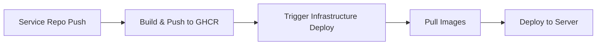

 Infrastructure

 

This repository manages the deployment infrastructure for all microservices.

 

## Architecture

 

```

                    ┌─────────────────┐

                    │   Nginx Proxy   │

                    │   (Port 80/443) │

                    └────────┬────────┘

                             │

            ┌────────────────┼────────────────┐

            │                │                │

    ┌───────▼──────┐ ┌──────▼──────┐ ┌──────▼──────┐

    │  Main Page   │ │ Highschool  │ │ Real Estate │

    │              │ │  Calendar   │ │ Calculator  │

    └──────────────┘ └─────────────┘ └─────────────┘

```

 

## Services

 

| Service | Image Source | URL |

|---------|-------------|-----|

| Main Page | Built locally | https://hstarsp.net/ |

| Nginx Proxy | nginx:alpine | - |

| Highschool Calendar | ghcr.io/zerone6/highschool-calendar | https://hstarsp.net/highschool/ |

| Real Estate Calc (Frontend) | ghcr.io/zerone6/realestate-calc-frontend | https://hstarsp.net/realestate/ |

| Real Estate Calc (Backend) | ghcr.io/zerone6/realestate-calc-backend | https://hstarsp.net/realestate/api/ |

 

## Repository Structure

 

```

infrastructure/

├── docker-compose.yml          # Service orchestration

├── nginx/

│   ├── nginx.conf             # Main nginx config

│   ├── conf.d/

│   │   └── default.conf       # Routing rules

│   └── ssl/

│       ├── fullchain.pem      # SSL certificate

│       ├── privkey.pem        # SSL private key (gitignored)

│       └── README.md          # Certificate management guide

├── main-page/

│   ├── index.html             # Landing page

│   ├── nginx.conf             # Main page nginx config

│   └── Dockerfile

└── .github/

    └── workflows/

        └── deploy.yml         # Deployment workflow

```

 

## Deployment Flow

 

### Automatic Deployment

 

1. **Service repositories** (highschool-calendar, my-realestate-calc) build and push Docker images to GHCR

2. **Infrastructure repository** pulls latest images and deploys to server

 



 

### Manual Deployment

 

```bash

# On server

cd ~/infrastructure

git pull origin main

docker compose pull

docker compose up -d

```

 

## Setup

 

### 1. GitHub Repository Setup

 

```bash

# Create new repository on GitHub

# Name: infrastructure

 

# Clone locally

cd /Users/seonpillhwang/GitHub

mkdir infrastructure

cd infrastructure

git init

git branch -M main

```

 

### 2. Copy Files from Highschool

 

```bash

# Copy nginx configuration

cp -r ../Highschool/nginx ./

 

# Copy main-page

cp -r ../Highschool/main-page ./

 

# Copy docker-compose.yml (from this README's artifacts)

# Copy .github/workflows/deploy.yml

```

 

### 3. Configure Secrets

 

Add these secrets to GitHub repository settings:

 

- `REMOTE_HOST` - Server IP or hostname

- `REMOTE_USER` - SSH username (e.g., ubuntu)

- `SSH_PRIVATE_KEY` - SSH private key for server access

 

### 4. SSL Certificates

 

SSL certificates are managed in `nginx/ssl/`:

 

```bash

# On server, copy certificates

sudo cp /etc/letsencrypt/live/hstarsp.net/fullchain.pem ~/infrastructure/nginx/ssl/

sudo cp /etc/letsencrypt/live/hstarsp.net/privkey.pem ~/infrastructure/nginx/ssl/

sudo chown $USER:$USER ~/infrastructure/nginx/ssl/*.pem

```

 

See `nginx/ssl/README.md` for certificate renewal instructions.

 

## Adding New Services

 

### 1. Update docker-compose.yml

 

```yaml

services:

  new-service:

    image: ghcr.io/zerone6/new-service:latest

    container_name: new-service

    expose:

      - "3000"

    networks:

      - web

    restart: unless-stopped

```

 

### 2. Update Nginx Configuration

 

Edit `nginx/conf.d/default.conf`:

 

```nginx

upstream new-service {

    server new-service:3000;

}

 

# In server block:

location /new-service/ {

    proxy_pass http://new-service/;

    # ... proxy headers ...

}

```

 

### 3. Update Main Page

 

Edit `main-page/index.html` to add new service card.

 

### 4. Commit and Push

 

```bash

git add .

git commit -m "feat: Add new-service integration"

git push origin main

```

 

## Monitoring

 

```bash

# View logs

docker compose logs -f

 

# View specific service logs

docker compose logs -f highschool

 

# Check container status

docker compose ps

 

# Restart specific service

docker compose restart nginx-proxy

```

 

## Troubleshooting

 

### Service won't start

 

```bash

# Check logs

docker compose logs [service-name]

 

# Check if image exists

docker images | grep ghcr.io/zerone6

 

# Manually pull image

docker pull ghcr.io/zerone6/highschool-calendar:latest

 

# Rebuild and restart

docker compose up -d --force-recreate [service-name]

```

 

### Nginx configuration errors

 

```bash

# Test nginx configuration

docker compose exec nginx-proxy nginx -t

 

# Reload nginx

docker compose exec nginx-proxy nginx -s reload

```

 

### SSL certificate issues

 

See `nginx/ssl/README.md` for certificate management.

 

## Maintenance

 

### Update all services

 

```bash

cd ~/infrastructure

git pull origin main

docker compose pull

docker compose up -d

```

 

### Restart all services

 

```bash

docker compose restart

```

 

### View resource usage

 

```bash

docker stats

```

 

## Related Repositories

 

- [highschool-calendar](https://github.com/zerone6/highschool-calendar) - 입시일정 선택 서비스

- [my-realestate-calc](https://github.com/zerone6/my-realestate-calc) - 부동산 계산기 서비스

- [infrastructure](https://github.com/zerone6/infrastructure) - This repository

 

## License

 

Private - Family use only